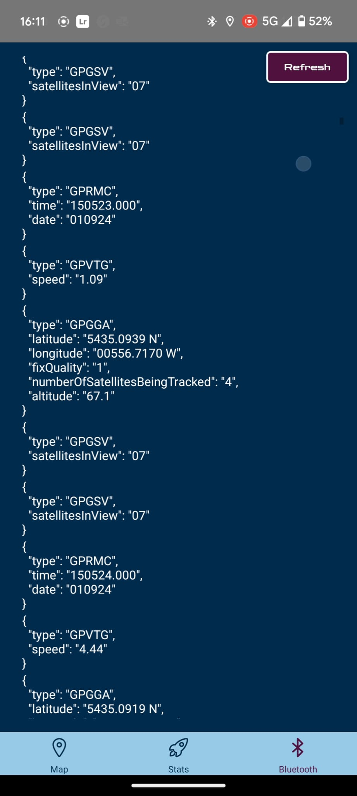
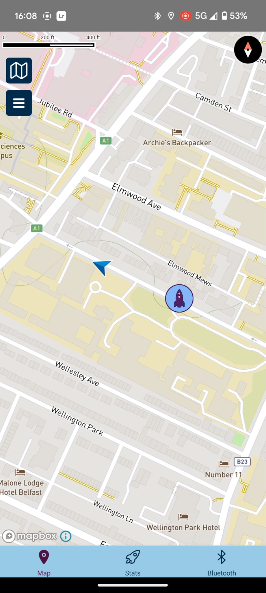
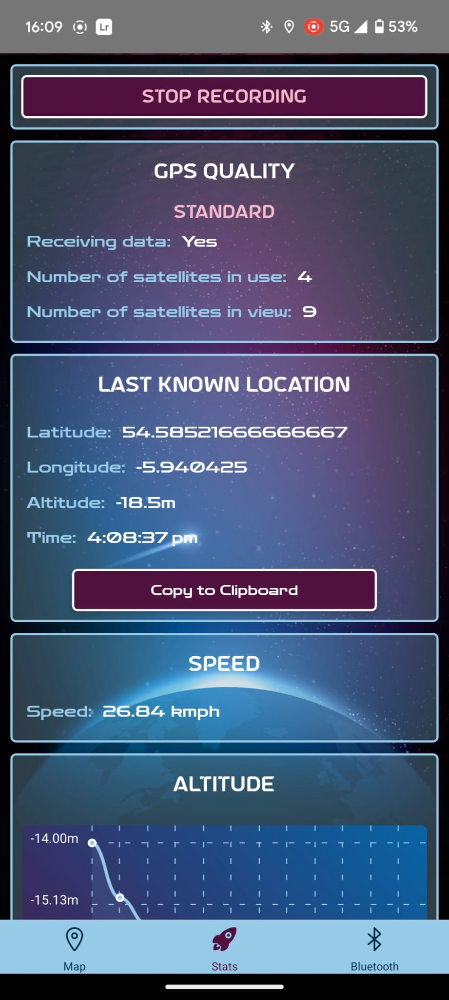
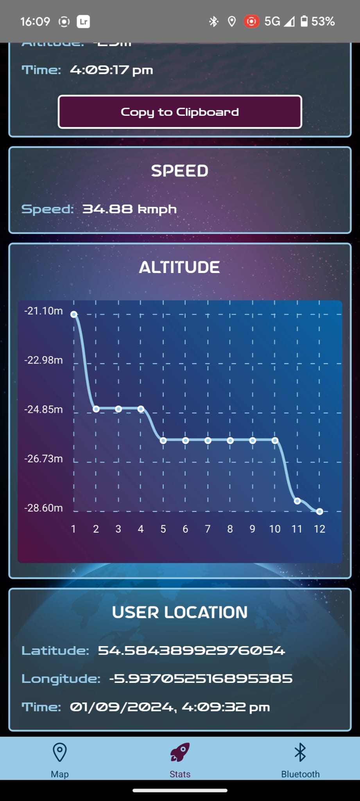

# Rocket Tracker Mobile App

### Rocket Tracker is an innovative Android application designed for hobby rocketeers to monitor and track their rockets in flight.

### Developed using React Native, this app offers real-time tracking, offline functionality, and a web-based companion for post-launch analysis.

## FEATURES:

### 🔵 **Bluetooth screen**

- Connect your device to an Eggtimer Receiver to track your rocket.
- View the raw telemtry data for your rocket.

### 🌍 **Map screen**

- Visualise your rocket's live location.
- Download offline maps for use in remote areas.
- Caluculate the distance between you and your rocket.

### 🚀 **Stats screen**

- View live telemtry data for your rocket.
- Longitude & Latitude coordinates, altitude, and speed.
- Record the data for future reviewal.

## Getting Started

### Prerequisites:

- Android device with Bluetooth capabilities
- Node.js and npm (Node Package Manager)

### Installation:

1. Clone the repository: **https://github.com/acaulfield97/RocketLaunchTracker.git**
2. Navigate into the project directory: **cd RocketLaunchTracker**
3. Install dependencies: **npm install --legacy-peer-deps**
4. Run the app: **npx react-native run-android**

### Using the App:

1. Launch the app on your Android device.
2. Connect to the Eggtimer receiver via Bluetooth from the Bluetooth settings within the app.
3. Begin monitoring your rocket's flight path on the Map and Stats screens.
4. Navigate to the companion web app to review detailed historic flight data (https://rockettrackerweb.vercel.app/).
